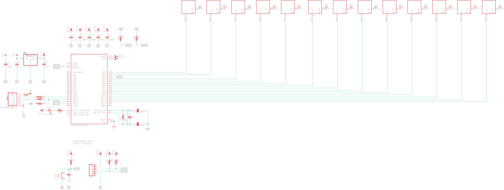
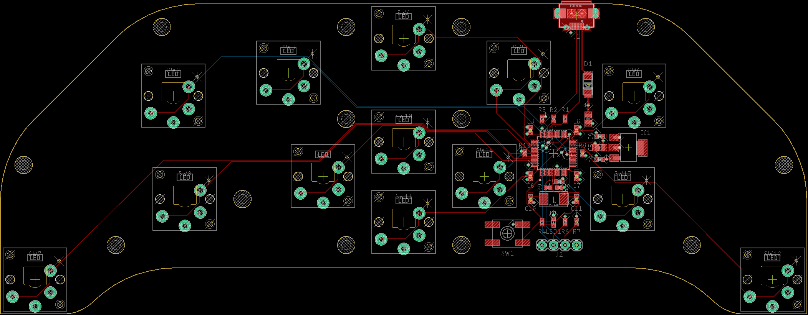
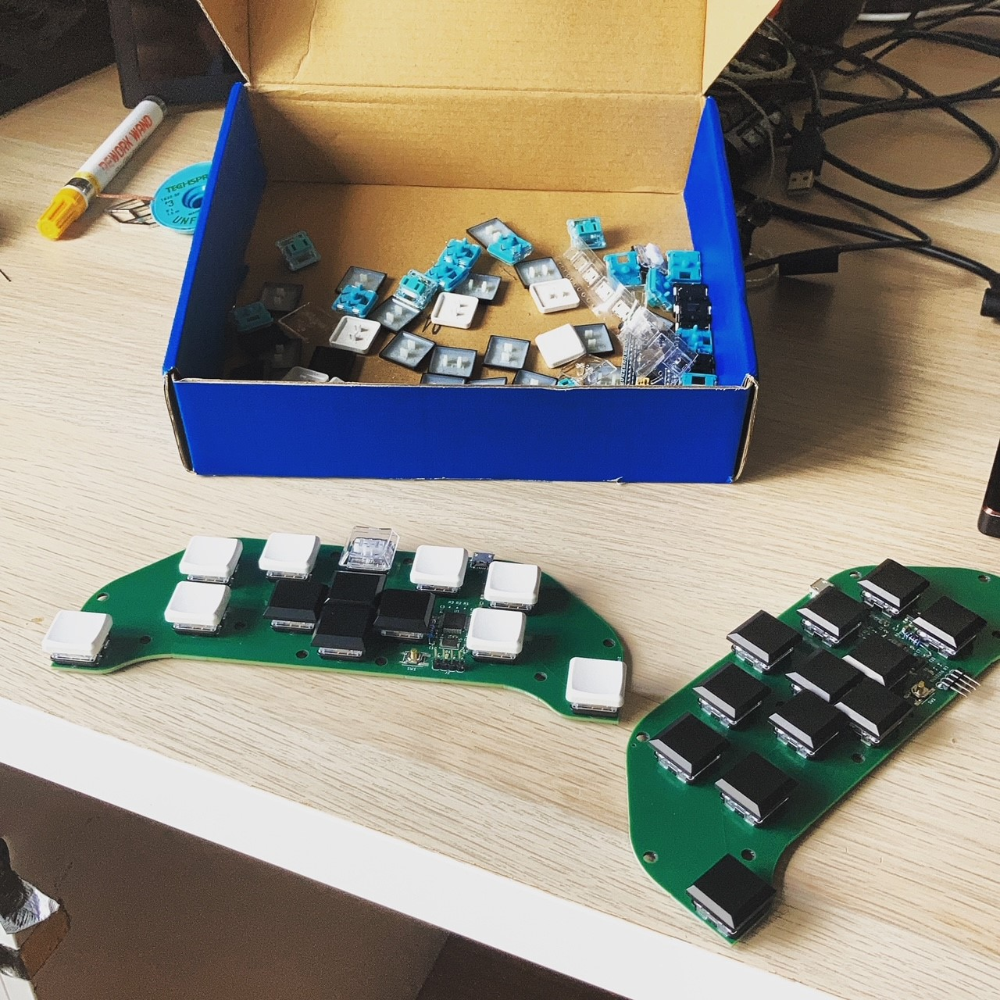

# foot-board
A USB Keyboard Device, laid out to be used with your Feet

Uses Kailh Low Profile Switches, code written to be easy to jump into and modify.

Can be produced by JLCPCB for extremely low cost. Only thing they cannot do is solder the MicroUSB jack; considering laying out the PCB with a connector for an off-the-shelf Blue Pill board to fix.

